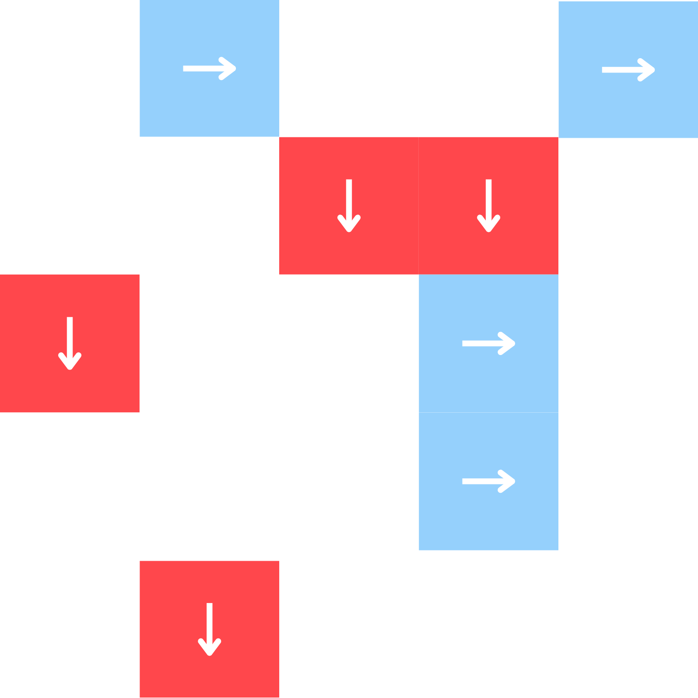
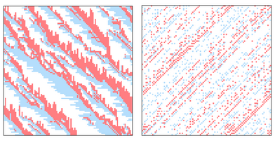
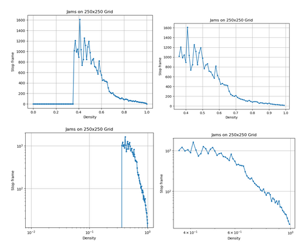
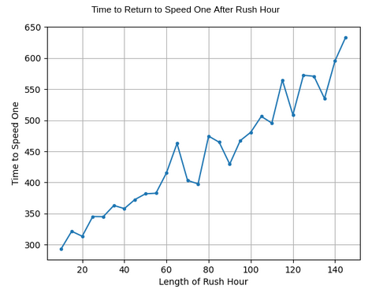

#  Jamming Parameter’s in a Biham-Middleton-Levine Traffic Model
## Maya Cranor and Becca Flach

### Abstract 
Rule 184 is a one-dimensional binary cellular automaton rule used to model traffic flow in a single lane of highway. The rule allows a cell to move forward one space if nothing is blocking it. Biham, Middleton, and Levine expanded on this concept and developed a 2D cellular automaton model where cars are preassigned to move horizontally in one direction and vertically in the other direction.

The Biham-Middleton-Levine (BML) model is capable of simulating various states of traffic, from traffic jams to free-flowing traffic, and intermittent phases. Free-flowing traffic occurs when every cell can move forward without being blocked; this is also referred to as speed one. A jam occurs when no cell can move in the system. We investigated the density at which the model becomes jammed or reaches speed one, as well as what happens when more cars are added to the system halfway through.

### Methodology

We began by creating an implementation of the BML model that could change the grid size and starting density. This was achieved by populating the grid randomly, checking the probability against each cell. Each cell had an equal probability of being either red or blue. In our model, blue cells move horizontally to the right, while red cells move vertically downward. We followed the traffic model version of the BML, where all blue cells move simultaneously at each time step, followed by all the red cells. At each time step, a cell can move forward if the cell directly next to it is empty. In our model, the edges wrap around so that cells never exit the system. The model will continue iterating for a set number of time steps. 

To explore the time frame at which the model jams for different densities, we set up a variable to record the first time step when blue and red cells didn’t move. Then we ran the model five times for every density between zero and one at intervals of 0.01. We averaged the results of the five trials to approximate the stop time.

#### Base BML Model and Results
The following graphs are of a 250x250 sized grid. From testing various grid sizes from 10x10 to 250x250 we found that the size didn’t make a difference on the pattern, however the result is more defined the bigger the grid size. Though the larger the grid size the longer it took each density to reach its jamming point. Jamming starts around a density of .35 to .4, which matches the result found in Nagatani’s paper. As the density increases the time it takes jam decreases less from it’s neighbor and the distribution of the trials becomes smaller. As the graph had a long tailed distribution we also plotted our results on a log log scale, and got a somewhat linear line.

 

### Extension EVERYTHING

For an extension, we decided to add a "rush hour" element to the model, by dynamically changing the number of cars in the grid. 
When the model reaches a given time step, a new car will be added on every free left and top edge square continuously for the length of the rush hour. After that time period ends, all cars have a 50% chance of being removed when they meet the right or bottom edge, until the density returns to the original density. 
We ran this adapted model with a density of 0.1, a density at which the base model reaches speed one consistently. We then ran the model with a variety of rush hour lengths, and plotted the amount of time it took for the model to return to speed one. 

  

The relationship is linear! Jams slow things down :(

### Conclusion

Traffic is bad for getting places 🙁

### Cause for Concern
Getting more interesting results or interpreting our results better
The computation time makes it hard to repeatedly run experiments
We don’t have any big concerns since our code runs for experiment and extension

### Next Steps

Make pretty graphs
Write everything up better
Make speed one graphs

### Annotated Bibliography 

[Self-organization and a dynamical transition in traffic flow models](https://sci-hub.ru/https://journals.aps.org/pra/abstract/10.1103/PhysRevA.46.R6124)
Ofer Biham, A. Alan Middleton, and Dov Levine 
This paper introduces the Biham-Middleton-Levine traffic model. The authors propose three variants of a two dimensional lattice, in each of which the grid has cars that can only move either right or up. In the first, there is a traffic light system that makes the different cars move at different times. The second model removes that, and the third model ignores interactions between the cars, making it essentially one dimensional. In these models, distinct phases of jams and free flowing traffic emerge and transition quickly. 

[Power-Law Distribution and 1/f Noise of Waiting Time near Traffic-Jam Threshold](https://sci-hub.ru/https://journals.jps.jp/doi/10.1143/JPSJ.62.2533)
Takashi Nagatani

Biham proposed a three-state CA on a square lattice, where each cell contains either a car moving upwards or left/right or it is empty. Musha used traffic flow in a one dimensional system says that it follows the Burgers equation. The paper explores the Biham model and looks to see at what density a traffic jam occurs.

[For what number of cars must self organization occur in the Biham-Middleton-Levine traffic model from any possible starting configuration?](https://arxiv.org/abs/math/0607759)
Tim D. Austin Itai Benjamini

This paper explores the Biham-Middleton-Levine model. Speed one is when every car is blocked from moving only finitely many times, and so after some finite time the cars all move freely. If the cars can’t move after awhile that means the model is stuck in a jam. The paper looks at initial configurations to determine when the model will hit speed one or get stuck. For any initial configuration of fewer than 1/2 N cars the BML model will self organize to attain speed one. On the other hand, there is a configuration of size m in which no car can move if and only if m is at least 2N.
