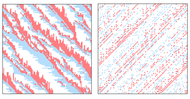
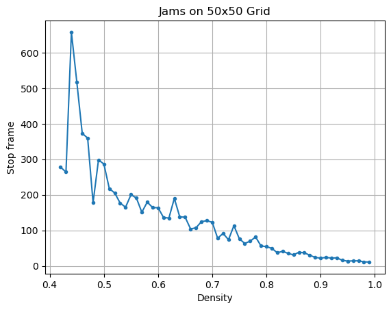
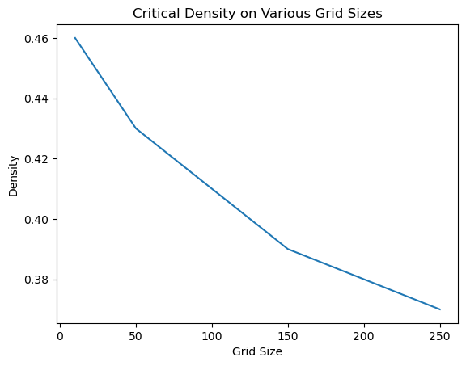
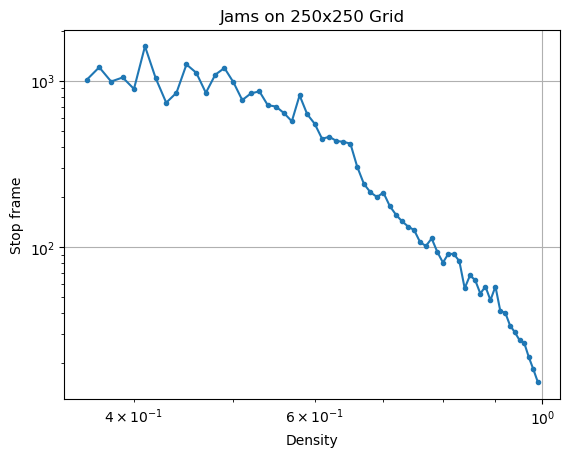
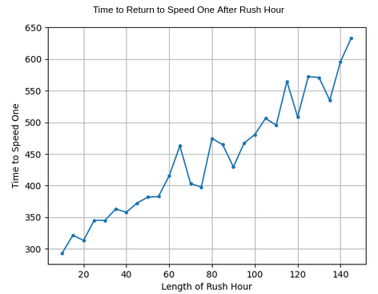

#  Jamming Parameter’s in a Biham-Middleton-Levine Traffic Model
### Maya Cranor and Becca Flach

## Abstract 
Rule 184 is a one-dimensional binary cellular automaton rule used to model traffic flow in a single lane of highway. The rule allows a cell to move forward one space if nothing is blocking it. Biham, Middleton, and Levine expanded on this concept and developed a 2D cellular automaton model where cars are preassigned to move horizontally in one direction and vertically in the other direction.

*Example of a 5x5 Biham-Middleton-Levine Model*

The Biham-Middleton-Levine (BML) model is capable of simulating various states of traffic, from traffic jams to free-flowing traffic, and intermittent phases. Free-flowing traffic occurs when every cell can move forward without being blocked; this is also referred to as speed one. A jam occurs when no cell can move in the system. We investigated the density at which the model becomes jammed or reaches speed one, as well as what happens when more cars are added to the system halfway through.

*Jammed BML model on the left, Speed one BML model on the right*

## Methodology

We start by creating an implementation of the BML model that can change the grid size and starting density. This is achieved by populating the grid randomly, checking the probability against each cell. Each cell has an equal probability of being either red or blue. In our model, blue cells move horizontally to the right, while red cells move vertically downward. We follow the traffic model version of the BML, where all blue cells move simultaneously at each time step, followed by all the red cells. At each time step, a cell can move forward if the cell directly next to it is empty. In our model, the edges wrap around so that cells never exit the system. The model continues iterating for a set number of time steps.

To explore the time frame at which the model jams for different densities, we set up a variable to record the first time step when blue and red cells do not move. When both blue and red cells cannot move, the model is fully jammed and nothing can move. Then we run the model five times for every density between zero and one at intervals of 0.01. We average the results of the five trials to approximate the stop time.

## Base BML Model and Results

The following graphs depict a 250x250 and 50x50 sized grid. When testing various grid sizes from 10x10 to 250x250, we find that the size does not affect the pattern significantly; however, the result becomes more defined as the grid size increases. The larger the grid size, the longer it takes for each density to reach its jamming point. Jamming begins around a density of .35 to .4, consistent with the findings in Nagatani’s paper. We also noted that the larger grids would tend to have a lower critical density.As the density increases, the time it takes to jam decreases less from its neighbor, and the distribution of the trials becomes smaller. As the graph exhibits a long-tailed distribution, we also plot our results on a log-log scale, however, we decided the line wasn't linear enough for the graph to be a long tailed distribution.

## Extension Methodology

For an extension, we are adding a "rush hour" element to the model by dynamically changing the number of cars in the grid. When the model reaches a given time step, a new car is added to every free left and top edge square continuously for the duration of rush hour. After that period ends, there is a 50% chance that cars will be removed when they reach the right or bottom edge, until the density returns to its original value. We are running this adapted model with a density of 0.1, at which the base model consistently reaches speed one. Then, we run the model with various rush hour lengths and plot the time it takes for the model to return to speed one.

## Extension Results

  

We are plotting the increase in time to return to speed one verus the length of the rush hour, and we find a roughly linear relationship. 
To investigate this further, we additionally plot how the measured density of the board increases during rush hour. Across all rush hours, the density increases ___ly. 

plot density decrease after rush hour?

We also plot the time to reach speed one across different densities, and find __

## Conclusion

We were able to replicate the BML model as well as the results found in Nagatani’s paper related to the critical density for traffic jams. Additionally we extended the experiment by simulating traffic jams. In both cases we found that the grid had a capacity and once that capacity would be reached, the grid would lock up. The system must be designed for the number of cars that will use it.

## Annotated Bibliography 

[Self-organization and a dynamical transition in traffic flow models](https://sci-hub.ru/https://journals.aps.org/pra/abstract/10.1103/PhysRevA.46.R6124)

Ofer Biham, A. Alan Middleton, and Dov Levine 

This paper introduces the Biham-Middleton-Levine traffic model. The authors propose three variants of a two dimensional lattice, in each of which the grid has cars that can only move either right or up. In the first, there is a traffic light system that makes the different cars move at different times. The second model removes that, and the third model ignores interactions between the cars, making it essentially one dimensional. In these models, distinct phases of jams and free flowing traffic emerge and transition quickly. 

[Power-Law Distribution and 1/f Noise of Waiting Time near Traffic-Jam Threshold](https://sci-hub.ru/https://journals.jps.jp/doi/10.1143/JPSJ.62.2533)

Takashi Nagatani

Biham proposed a three-state CA on a square lattice, where each cell contains either a car moving upwards or left/right or it is empty. Musha used traffic flow in a one dimensional system says that it follows the Burgers equation. The paper explores the Biham model and looks to see at what density a traffic jam occurs.

[For what number of cars must self organization occur in the Biham-Middleton-Levine traffic model from any possible starting configuration?](https://arxiv.org/abs/math/0607759)

Tim D. Austin Itai Benjamini

This paper explores the Biham-Middleton-Levine model. Speed one is when every car is blocked from moving only finitely many times, and so after some finite time the cars all move freely. If the cars can’t move after awhile that means the model is stuck in a jam. The paper looks at initial configurations to determine when the model will hit speed one or get stuck. For any initial configuration of fewer than 1/2 N cars the BML model will self organize to attain speed one. On the other hand, there is a configuration of size m in which no car can move if and only if m is at least 2N.
